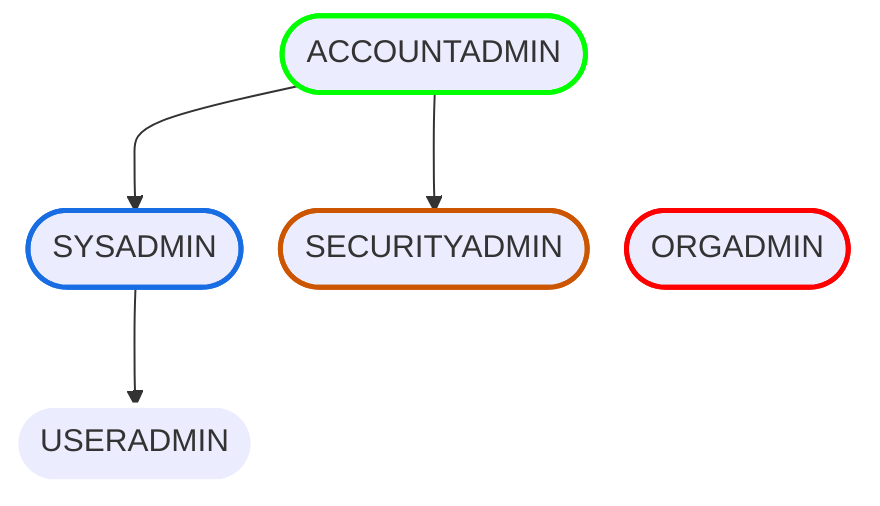

# What is RBAC?

Role-Based Access Control is the means by which Snowflake secures database objects from 
unintended use by the wrong users.  

At the top of the role list is the **Account Administrator** (ACCOUNTADMIN).  
This role has the highest level of account privileges.  

Tangential to the ACCOUNTADMIN is the Organization Administrator (ORGADMIN).  
They have the unique ability to create new accounts. 

 

The simplest kind of account privilege structure in Snowflake is like the following:

 

